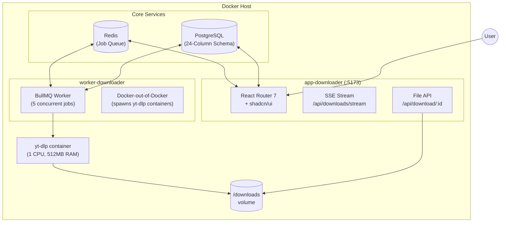
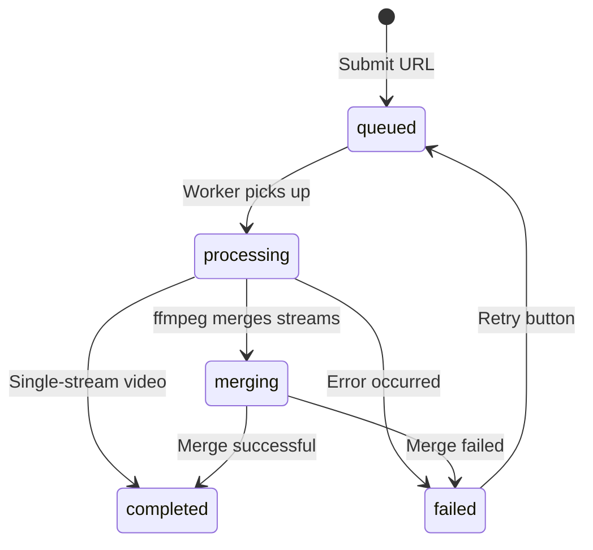

# YT-DLP Video Downloader

A full-stack YouTube video/audio downloader with a modern web dashboard, built using Docker-out-of-Docker (DooD) orchestration. Features real-time download progress, flexible quality/format options, job queue management, and a premium shadcn/ui interface.

   

## ✨ Key Features

| Feature | Description |
|---------|-------------|
| 🎬 **Multi-Quality Download** | Choose from Best, 1080p, 720p, 480p, or 360p |
| 🎵 **Audio-Only Mode** | Extract audio in MP3, M4A, OPUS, WAV, AAC, or FLAC |
| 📝 **Subtitles** | Download & embed subtitles with language selection |
| 🖼️ **Thumbnails** | Download & embed video thumbnails |
| 🔄 **Flexible Re-download** | Same video, different configs (video + audio-only) |
| 🔁 **Retry Failed Jobs** | One-click retry with original configuration |
| 📥 **Browser Downloads** | Download completed files directly from dashboard |
| 📊 **Real-Time Progress** | Live SSE updates with merging status detection |
| 🐳 **Isolated Containers** | Each download runs in its own yt-dlp container |

## 📦 Architecture



### Component Overview

| Service | Tech Stack | Lines of Code |
|---------|------------|---------------|
| **app-downloader** | React Router 7, shadcn/ui (17 components), Drizzle ORM, TailwindCSS | ~27KB main route |
| **worker-downloader** | Node.js, BullMQ, Dockerode, PostgreSQL client | ~400 lines |
| **yt-downloader** | Python 3.12, yt-dlp, ffmpeg, deno (for JS extraction) | Dockerfile only |

## 🗃️ Database Schema

The `downloads` table tracks all job metadata and configurations:

```sql
downloads (
  -- Core
  id, video_id, url, title, status, progress, job_id, error,
  
  -- Quality & Format Options
  quality,           -- 'best' | '1080p' | '720p' | '480p' | '360p'
  format,            -- 'mp4' | 'mkv' | 'webm'
  audio_only,        -- boolean
  audio_format,      -- 'mp3' | 'm4a' | 'opus' | 'wav' | 'aac' | 'flac'
  
  -- Subtitle Options
  download_subtitles, subtitle_language, embed_subtitles,
  
  -- Thumbnail Options
  download_thumbnail, embed_thumbnail,
  
  -- Result Metadata
  file_size, duration, resolution, file_name,
  
  -- Timestamps
  created_at, updated_at
)
```

**Indexes:** `video_id`, `status`, `created_at`, `job_id`

## 🚀 Getting Started

### Prerequisites

- **Docker** & **Docker Compose** v2+
- Ports `5173`, `5434`, `6379` available

### Quick Start

```bash
# 1. Clone & enter directory
git clone <repository-url> && cd yt-dlp

# 2. Build the yt-dlp container image
docker build -t yt-dlp-local ./yt-downloader

# 3. Start development environment
docker compose -f docker-compose.dev.yml up --build

# 4. Push database schema (new terminal)
docker compose -f docker-compose.dev.yml exec app-downloader npm run db:push

# 5. Open dashboard
open http://localhost:5173
```

## 💻 Development

### Hot Reload

Both services support hot-reload in development:
- **app-downloader**: Vite HMR on port 5173
- **worker-downloader**: nodemon watches for changes

### Project Structure

```
yt-dlp/
├── app-downloader/              # Frontend + API
│   ├── app/
│   │   ├── components/ui/       # 17 shadcn/ui components
│   │   ├── db/                  # Drizzle schema (24 columns)
│   │   ├── lib/                 # Config, validation, queue client
│   │   ├── routes/
│   │   │   ├── home.tsx         # Main dashboard (~27KB)
│   │   │   ├── api.downloads.stream.ts  # SSE endpoint
│   │   │   └── download-file.ts # File download API
│   │   └── services/            # DownloadService
│   └── Dockerfile
│
├── worker-downloader/           # Background processor
│   └── src/
│       ├── config/
│       │   ├── constants.js     # Quality presets, limits
│       │   ├── docker.js        # Dockerode client
│       │   └── redis.js         # Redis with retry
│       ├── db/                  # Raw SQL queries
│       ├── services/
│       │   └── dockerService.js # Container lifecycle
│       ├── utils/
│       │   ├── commandBuilder.js # yt-dlp args builder
│       │   └── index.js         # Throttle, sleep
│       └── workers/
│           └── downloadWorker.js # BullMQ processor
│
├── yt-downloader/               # yt-dlp Docker image
│   └── Dockerfile               # Python + yt-dlp + ffmpeg + deno
│
├── downloads/                   # Mounted volume for files
├── docker-compose.yml           # Production
└── docker-compose.dev.yml       # Development
```

### Database Commands

```bash
# Push schema changes (dev only - auto-applies)
docker compose -f docker-compose.dev.yml exec app-downloader npm run db:push

# Generate migration files
docker compose -f docker-compose.dev.yml exec app-downloader npm run db:generate

# Open Drizzle Studio (database GUI)
docker compose -f docker-compose.dev.yml exec app-downloader npm run db:studio

# Reset database (DESTRUCTIVE)
docker compose -f docker-compose.dev.yml exec postgres \
  psql -U downloader -d downloader -c "TRUNCATE downloads RESTART IDENTITY;"
```

## ⚙️ Configuration

### Worker Constants

```javascript
{
  WORKER_CONCURRENCY: 5,           // Parallel downloads
  CONTAINER_CPU_LIMIT: 1 CPU,      // Per yt-dlp container
  CONTAINER_MEMORY_LIMIT: 512MB,   // Per yt-dlp container
  PROGRESS_THROTTLE_MS: 1000,      // DB update frequency
  JOB_MAX_ATTEMPTS: 3,             // Retry count
  JOB_BACKOFF_TYPE: 'exponential', // Retry strategy
}
```

### Quality Presets

| Preset | yt-dlp Format Selector |
|--------|------------------------|
| `best` | `bestvideo+bestaudio/best` |
| `1080p` | `bestvideo[height<=1080]+bestaudio/best[height<=1080]` |
| `720p` | `bestvideo[height<=720]+bestaudio/best[height<=720]` |
| `480p` | `bestvideo[height<=480]+bestaudio/best[height<=480]` |
| `360p` | `bestvideo[height<=360]+bestaudio/best[height<=360]` |

### Environment Variables

| Variable | Service | Default | Description |
|----------|---------|---------|-------------|
| `REDIS_HOST` | All | `redis` | Redis hostname |
| `DATABASE_URL` | All | - | PostgreSQL connection string |
| `DOCKER_DOWNLOADS_PATH` | worker | `${PWD}/downloads` | Host path for downloads |
| `NODE_ENV` | app | `development` | Environment mode |

## 📊 Download Statuses



| Status | Badge Color | Description |
|--------|-------------|-------------|
| `queued` | Gray | Waiting in BullMQ queue |
| `processing` | Indigo | yt-dlp downloading (shows %) |
| `merging` | Amber | ffmpeg merging video+audio |
| `completed` | Green | Ready for download |
| `failed` | Red | Check error message |

## 🏭 Production

```bash
# Build all images
docker compose build
docker build -t yt-dlp-local ./yt-downloader

# Start production
docker compose up -d

# View logs
docker compose logs -f
```

**Production differences:**
- Port `3000` instead of `5173`
- No source volume mounts
- Built SSR server
- `restart: always` for reliability

## 🔧 Troubleshooting

### Docker Socket Permission
```bash
sudo usermod -aG docker $USER && newgrp docker
```

### yt-dlp Image Missing
```bash
docker build -t yt-dlp-local ./yt-downloader
```

### Rate Limit Errors (429)
The worker uses `--ignore-errors` flag, so subtitle download failures won't block the main video. YouTube rate limits are temporary.

### Orphan Containers
The worker automatically cleans up orphan yt-dlp containers on startup.

## 🎨 UI Components

Built with **shadcn/ui** (17 components):

`Badge` `Button` `Card` `Checkbox` `Input` `Label` `Progress` `ScrollArea` `Select` `Separator` `Sheet` `Sidebar` `Skeleton` `Sonner` `Switch` `Table` `Tooltip`

## 📝 License

ISC

---

**Built with ❤️ using Docker, React Router 7, shadcn/ui, yt-dlp, and Google Antigravity**
